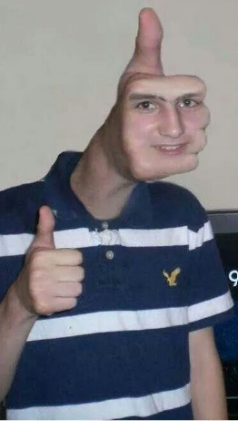
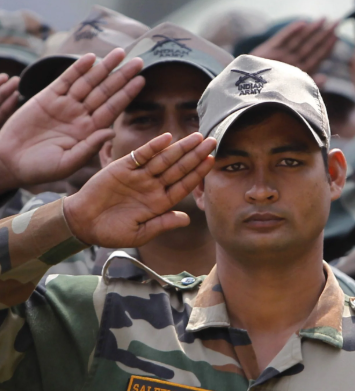
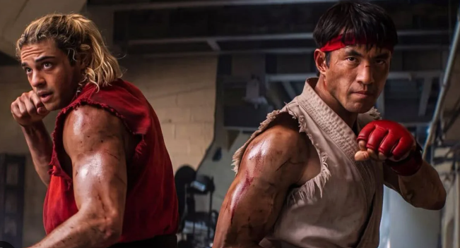
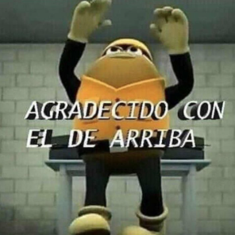
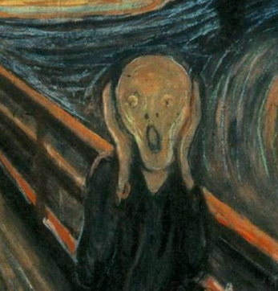
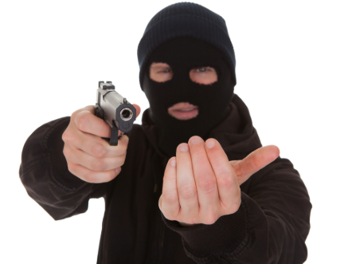

## tarea-02
Hugo Montoya

- Asignatura: Dispositivos Periféricos y Plataformas para la Interacción Digital **DIS9087**

Proyecto de reconocimiento de gestos, utilizando Python y MediaPipe. Realizado tomando como referencia este repositorio:

- <https://github.com/catherpiee/meowmeowcatcam>

## Gestos

| # | *Nombre* | *Cómo se activa* | *imagen* |
| --- | --- | --- | --- |
| 1 |paz  | índice y corazón extendidos |  |
| 2 | ILY | índice, meñique y pulgar extendidos |  |
| 3 | pulgar arriba | pulgar arriba  |  |
| 4 | saludo | extender todos los dedos de una mano |  |
| 5 | doblePuño | cerrar dos puños |  |
| 6 | dobleIndice | extender dos dedos índices |  |
| 7 | bocaAbierta | Abrir boca |  |
| 8|Manos arriba | manos extendidas arriba de la cabeza |  |

- [video](./)
